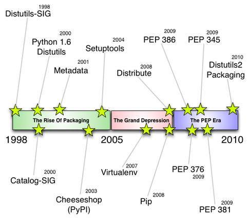
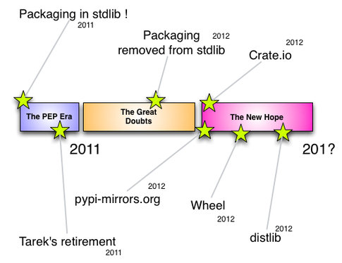
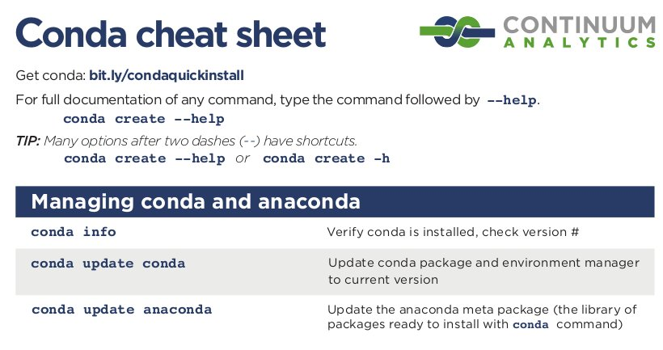

.. role:: bluetext

.. role:: greentext

.. role:: graytext

.. role:: yellowtext

.. footer::

    David Froger (SED Paris-Rocquencourt)

.. header::

    :graytext:`Le gestionnaire de paquet Conda http://conda.pydata.org (###Page### / ###Total###)`

.. raw:: pdf

    PageBreak coverpage

Le gestionnaire de paquet Conda
------------------------------------------------------------------------------

http://conda.pydata.org

.. raw:: pdf

    PageBreak full

Plan
------------------------------------------------------------------------------

* Introduction à Conda

* Exemple concret de création de paquets

* Les détails et difficultés

Introduction à Conda
------------------------------------------------------------------------------

  * Les grandes lignes
  * Installer des paquets
  * Créer un paquet
  * Partager un paquet

Grandes lignes
------------------------------------------------------------------------------

* Un **gestionnaire de paquets** (à la `apt-get`)

* **Multi-plateforme** : GNU/Linux, Windows, OS X

* Issue de la communauté **Python scientifique**

* **Indépendant** d'un langage
  
* **Libre** (BSD)

Caractéristiques de Conda (1/2)
------------------------------------------------------------------------------

* Distribution de paquets **binaires**. Il faut créer un paquet pour chaque
  plateforme:

    * GNU/Linux 32 bits et 64 bits
    * Windows  32 bits et 64 bits
    * OS X 64 bits

* Gestion des **dépendances**, des **versions** (Solveur SAT)

* Gestion d'**environnements** (à la `virtualenv`). Possibilité d'installer
  plusieurs versions d'une bibliothèque

* Installation depuis différents **channels**

Buts d'un gestionnaire de paquet
------------------------------------------------------------------------------

* Distribuer son logiciel ou sa bibliothèque aux utilisateurs

* Faciliter l'installation

* Faciliter la mise à jour

* Tester rapidement une idée 

* Fournir les dépendances aux développeurs

* Exemple de l'API de **Numpy** qui n'a pas évolué à cause des difficultés
  d'installation sous **Windows**.

.. Autres solutions
.. ---------------------------------------------------------------------------

.. raw:: pdf

    PageBreak columns

**Python**:
  * easy_install
  * pip

**Linux**:

  * apt-get, aptitude
  * yum 
  * pacman
  * nix

.. raw:: pdf

    FrameBreak

**OS X**:

  * macports
  * homebrew
  * fink

**Windows**:

  * chocolately
  * npackd

.. Historique des gestionnaire de paquet pour Python
.. ---------------------------------------------------------------------------

.. raw:: pdf

    PageBreak columns

.. raw:: pdf

    FrameBreak

.. raw:: pdf

    PageBreak full

Pourquoi pas **pip**
------------------------------------------------------------------------------

**pip** fonctionne seulement avec Python, manque de support pour
les bibliothèques compilées (C, C++, Fortran).

**distutils** : pas conçu pour paquets binaires

**setuptools** : très compliqué (`monkeypatch`), `sys.path` à entrées multiples

Exemple de l'installation de **h5py**:

* avec **pip** : essaiera de trouver `HDF5`, de le compile avec `cython`. Risque d'erreur
  obscure de compilation. L'utilisateur est son propre intégrateur.

* avec **Conda** : `h5py`, `HDF5` et `Python` sont des paquets Conda.

Communauté très active
------------------------------------------------------------------------------

* https://github.com/conda

* http://continuum.io/

* http://conda.pydata.org/docs/

* https://groups.google.com/a/continuum.io/forum/#!forum/conda

Plateforme de partage de paquets
------------------------------------------------------------------------------

* http://anaconda.org/

* Possibilité de déposer un paquet sur son compte

* Possibilité d'installer un paquet depuis un compte public

Mémorandum
------------------------------------------------------------------------------

Utilisation de Conda (exemple 0)
------------------------------------------------------------------------------

* Installer Conda grâce à  l'installateur `miniconda` : http://conda.pydata.org/miniconda.html

* Créer a environnement **tuto27** with **python 2.7**, **numpy** et **matplotlib**.

* Activé l'environnement **tuto27**.

* Exécuter le script: **python 0_use_conda/tuto27.py**

* Créer un environnement **tuto35** pour exécuter le script: **python 0_use_conda/tuto35.py**

Recettes Conda
------------------------------------------------------------------------------

* Un fichier **meta.yaml** qui contient les informations sur le paquet :
  version, dépendances, licenses

* Un script **build.sh** ou **bld.bat** pour construire le paquet

* Les recettes sont versionnées, reproductible, partageables

build.sh de HDF5
------------------------------------------------------------------------------

.. code-block:: bash

    ./configure --prefix=$PREFIX --enable-linux-lfs \
                --with-zlib=$PREFIX --with-ssl
    make
    make install

    rm -rf $PREFIX/share/hdf5_examples

meta.yaml de HDF5 (1/2)
------------------------------------------------------------------------------

.. code-block:: yaml

    package:
      name: hdf5
      version: 1.8.13

    source:
      fn: hdf5-1.8.13.tar.bz2
      url: http://www.hdfgroup.org/(...)/hdf5-1.8.13.tar.bz2
      md5: b060bb137d6bd8accf8f0c4c59d2746d

meta.yaml de HDF5 (2/2)
------------------------------------------------------------------------------

.. code-block:: yaml

    requirements:
      build:
        - zlib
      run:
        - zlib
    about:
      home: http://www.hdfgroup.org/HDF5/
      license: BSD-style

Construction d'un paquet
------------------------------------------------------------------------------

.. code-block:: bash

    conda build .

* Télécharge et extrait les sources

* Exécute build.sh

* Créé l'archive `hdf5-1.8.13-0.tar.bz2`

Partage d'un paquet
------------------------------------------------------------------------------

.. code-block:: bash

    anaconda upload hdf5-1.8.13-0.tar.bz2

.. code-block:: bash

    https://anaconda.org/dfroger/hdf5/1.8.13-0/
       download/linux-64/hdf5-1.8.13-0.tar.bz2

Installation d'un paquet
------------------------------------------------------------------------------

* paquet téléchargé et décompresser dans pkgs/
* création de liens dans le répertoire de l'environnemnt
* Relocalisation
* mise à jour des méta-données de Conda
* éventuellement script de `post-link`
* seulement modification du `PATH` lors d'un changement d'environnement

Où Conda installe t-il? (1/2)
------------------------------------------------------------------------------

.. code-block:: bash

    /local/froger/miniconda/
       bin/
       lib/
       envs/
          tuto27/
             bin/
             lib/
             ...
          tuto35/
             bin/
             lib/
             ...
       pkgs/
           numpy-1.10.1-py27_0/
             bin/
             lib/
             ...

Où Conda installe t-il? (2/2)
------------------------------------------------------------------------------

* Pas besoin de privilège super utilisateur

* Hiérarchie de répertoires simples

* Simple liens symboliques de `pkgs/` vers `envs/name/`

meta.yaml de H5PY (1/2)
------------------------------------------------------------------------------

.. code-block:: yaml

    requirements:
      build:
        - numpy
        - hdf5
        - cython

meta.yaml de H5PY (2/2)
------------------------------------------------------------------------------

.. code-block:: yaml

      run:
        - python
        - numpy
        - hdf5

build.sh de H5PY
------------------------------------------------------------------------------

.. code-block:: bash

    #!/bin/bash

    export HDF5_DIR=$PREFIX

    $PYTHON setup.py install

.. raw:: pdf

    PageBreak columns

**Exemple concret : Partitionnement d'un graphe avec Metis**.

* Création d'un **paquet** `metis`:

  * langage **C**.
  * des **exécutables**.
  * un fichier d'entête **metis.h** et une bibliothèque **libmetis.so**.

* Appel d'un **exécutable** de `metis`.

* Utilisation de la **bibliothèque** `C` de `metis`.

* Création d'un **paquet** pour l'interface **Python** de `metis`.

* **Import** du module Python de `metis`.

.. raw:: pdf

    FrameBreak

.. image:: graph.pdf
    :height: 9cm

Exemple de https://metis.readthedocs.org

.. raw:: pdf

    PageBreak full

Création d'un paquet Conda pour `metis` (exemple 1)
------------------------------------------------------------------------------

* Écrire la recette Conda:

.. code-block:: bash

  1_create_metis_pkg/meta.yaml
  1_create_metis_pkg/build.sh

* Construire le paquet Conda dans les fichiers:

.. code-block:: bash

    conda build 1_create_metis_pkg

* Que contient le paquet?

* Partager le paquet

.. code-block:: bash
  
    anaconda upload ...

Appel d'un exécutable `metis` (exemple 2)
------------------------------------------------------------------------------

* Installer le paquet `tuto-metis`.

.. code-block:: bash
  
    $ conda install -c inria-pro-sed tuto-metis

* La commande `gpmetis` est accessible:

.. code-block:: bash
  
    $ which gpmetis
    /home/froger/miniconda3/envs/tuto/bin/gpmetis

* Partitionner le graphe:

.. code-block:: bash

    $ gpmetis graph.txt 3

Utilisation de la **bibliothèque** `C` de `metis` (exemple 3)
------------------------------------------------------------------------------

.. code-block:: makefile

    CFLAGS = -I$(CONDA_ENV_PATH)/include
    LDFLAGS = -L$(LIBDIR) -Wl,-rpath,$(LIBDIR) -lmetis
    LIBDIR = $(CONDA_ENV_PATH)/lib

    main: main.o
      $(CC) -o $@ $< $(LDFLAGS)

    main.o: main.c
      $(CC) -c $< $(CFLAGS)

.. code-block:: bash

    $ make
    $ ./main
    objval: 2
    part: 0 0 0 0 0 0 1 2 2 2 2 2 2 1 1 1 1 1 1

Création d'un **paquet** pour l'interface **Python** de `metis` (exemple 4)
------------------------------------------------------------------------------

* Écrire la recette Conda:

.. code-block:: bash

  4_create_metis_python_pkg/meta.yaml
  4_create_metis_python_pkg/build.sh

* Construire le paquet Conda dans les fichiers:

.. code-block:: bash

    conda build 4_create_metis_python_pkg

* Que contient le paquet?

* Partager le paquet

.. code-block:: bash
  
    anaconda upload ...

**Import** du module Python de `metis` (exemple 5)
------------------------------------------------------------------------------

* Installer les paquets conda:

  * tuto-metis-python
  * matplotlib
  * networkx
  * pydot-ng

* Exécuter le script Python:

.. code-block:: bash
  
    $ python 5_import_metis_python/main.py

* Visualiser le fichier de sortie `example.svg`.

Les détails et difficultés
------------------------------------------------------------------------------

* relocalisation
* environnement de construction
* sécurité

Relocalisation (Exemple 6)
------------------------------------------------------------------------------

.. code-block:: bash

    $ make PREFIX=$HOME/tuto-reloc install
    $ tree $HOME/tuto-reloc/
    /home/david/tuto-reloc/
        bin/
            helloA
            helloB
        lib/
            libgreet.so

    $ $HOME/tuto-reloc/bin/helloA # fichier texte
    Hello, this is an hardcoded path: /home/david/tuto-reloc

    $ $HOME/tuto-reloc/bin/helloB # fichier binaire
    Hello, this is an hardcoded path: /home/david/tuto-reloc

    $ ldd $HOME/tuto-reloc/bin/helloB | grep greet
    /home/david/tuto-reloc/lib/libgreet.so (0x00007f3745798000)

Relocalisation (Exemple 6)
------------------------------------------------------------------------------

.. code-block:: bash

    $ mv $HOME/tuto-reloc/ $HOME/tuto-reloc-moved

    $ $HOME/tuto-reloc-moved/bin/helloA # fichier texte
    Hello, this is an hardcoded path: /home/david/tuto-reloc
    # échec si l'on essaie de lire un fichier 
    # dans /home/david/tuto-reloc

    $ $HOME/tuto-reloc-moved/bin/helloB # fichier binaire
    /home/david/tuto-reloc-moved/bin/helloB: 
      error while loading shared libraries:
      /home/david/tuto-reloc/lib/libgreet.so:
      cannot open shared object file: No such file or directory

Relocalisation
------------------------------------------------------------------------------

Pour installer un paquet dans un répertoire quelconque:

    - Mettre à jour le **chemin vers les bibliothèques partagées** avec
      `install_name_tool` sur `OS X` or `patchelf` sur GNU/Linux. 
    - Mettre à jour les **chemins en dur** dans les fichiers **binaires** et
      **textes**.

Dans le fichier `meta.yaml`:

.. code-block:: yaml

    build:
      binary_relocation: true
      detect_binary_files_with_prefix: True

Compatibilité de API et ABI des bibliothèques systèmes.
------------------------------------------------------------------------------

* `GNU/Linux`: compatibilité descendante de l'API de `glibc`. Solution:
  compiler sur une version ancienne de GNU/Linux

* `OS X`: 

  * `MACOSX_DEPLOYMENT_TARGET=10.6`, nécessite le `SDK` de `OS X 10.6`.

  * `libstdc++` (`GNU`) et `libc++` (`clang`) sont incompatible.

* Paquet Conda pour `gcc`.

* Fortran http://hpc.sourceforge.net/

glibc and gcc versions
------------------------------------------------------------------------------

+--------------+--------+-------+
| distribution | glibc  | gcc   |
+==============+========+=======+
| centos 5.11  | 2.5    | 4.1.2 |
+--------------+--------+-------+
| centos 6.6   | 2.12   | 4.4.7 |
+--------------+--------+-------+
| centos 7.0   | 2.17   | 4.8.3 |
+--------------+--------+-------+
| ubuntu 12.04 | 2.15   | 4.6.3 |
+--------------+--------+-------+
| ubuntu 14.04 | 2.19   | 4.8.2 |
+--------------+--------+-------+
| debian 7     | 2.13   | 4.7.2 |
+--------------+--------+-------+
| fedora 17    | 2.15   | 4.7.0 |
+--------------+--------+-------+
| suse 12.1    | 2.12.1 | 4.6.2 |
+--------------+--------+-------+

Informations de http://distrowatch.com

Environnement de build vagrant
------------------------------------------------------------------------------

* http://ipscc.readthedocs.org

* `box` Vagrant pour `GNU/Linux` et `OS X`.

* Reproductibilité

* Minimise le risque les dépendances dans le système

Sécurité
------------------------------------------------------------------------------

* Dépôt de `Continuum` en `https`: https://repo.continuum.io/pkgs

* Possiblité de signer les paquets

* http://anaconda.org/ : ni `https` si signatures

Installation centralisée
------------------------------------------------------------------------------

* Possibilité d'une installation administrateur

* Limitation des `channels` pouvant être utilisés

Créer sont propre dépôt Conda
------------------------------------------------------------------------------

* Mettre les paquets dans un dossier

* Commande `conda index`

* Utiliser le protocole `http(s)//`, `file//`, ...

* Possibilité de signer les paquets, vérification à l'installation

Merci! Question?
------------------------------------------------------------------------------
